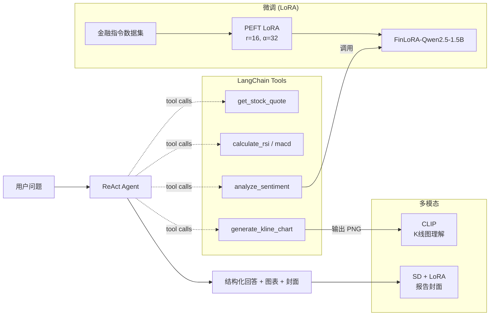

# FinLoRA-Agent

> 把 LLM 微调 / Agent 编排 / 多模态生成串成一个完整的「量化研究助手」。
>
> A complete *fine-tune → agent → multimodal* pipeline for quantitative finance research.

[English](./README_EN.md) · [中文版]

---

## TL;DR

| 模块 | 技术 | 一句话总结 |
| --- | --- | --- |
| **微调** | Qwen2.5-1.5B-Instruct + LoRA (PEFT/TRL) | 在 ~2K 条金融情感数据上 LoRA 微调，3 epoch / A6000 / 单卡 30 min。 |
| **Agent** | LangChain ReAct | 把微调模型 + yfinance + 技术指标 + SD 封面 串成一个 ReAct 智能体。 |
| **图像理解** | CLIP zero-shot | 给 K 线图打 BULLISH / BEARISH / SIDEWAYS / VOLATILE 标签。 |
| **图像生成** | Stable Diffusion + LoRA | SD 1.5 文生图做报告封面，含一个 SD-LoRA 风格迁移训练脚本。 |
| **Demo** | Gradio | 一站式 Web UI，4 个 Tab 涵盖全部能力。 |

---

## 项目动机

量化研究的工作流里有大量「读新闻判方向 / 看 K 线判形态 / 给策略写报告」的环节，
都可以用生成式 AI 加速。但通用 LLM 在金融语料上有两类常见问题：

1. **情感判断保守**——倾向输出 NEUTRAL，错过有方向性的信号；
2. **不会调用工具**——无法把"看新闻"和"查行情"自动衔接起来。

本项目用 **LoRA 微调** 解决问题 1，用 **LangChain ReAct Agent** 解决问题 2，
并补一个 **多模态** 模块覆盖图像理解/生成的常见量化场景。

---

## 项目结构

```
FinLoRA-Agent/
├── data/
│   ├── prepare_data.py          # 拉 HF 数据 + 兜底 samples
│   └── samples/                 # 35 条手工中英混合样例
├── train/
│   ├── train_lora.py            # 从零写的 PEFT + TRL.SFTTrainer 训练脚本
│   ├── eval_model.py            # base vs LoRA acc/F1/confusion-matrix 对比
│   ├── plot_curves.py           # 训练曲线绘制
│   └── configs/qwen_lora.yaml   # LLaMA-Factory 等价配置 (二选一即可)
├── agent/
│   ├── sentiment_llm.py         # 微调模型推理封装 (单例 + LoRA 合并)
│   ├── tools.py                 # 5 个 LangChain Tool: 报价/RSI/MACD/情感/绘图
│   └── finance_agent.py         # ReAct Agent (支持 OpenAI / DeepSeek / 本地)
├── multimodal/
│   ├── chart_understanding.py   # CLIP zero-shot K 线图分类
│   ├── sd_generate.py           # SD 文生图 (支持挂载自训 LoRA)
│   └── train_sd_lora.py         # SD UNet cross-attn LoRA 训练脚本
├── demo/app.py                  # Gradio 4-Tab 演示
├── eval/                        # 评测结果 json
└── scripts/                     # 一键脚本
```

---

## 架构图



---

## 快速开始

### 1. 环境

```bash
git clone https://github.com/<your-user>/FinLoRA-Agent.git
cd FinLoRA-Agent
pip install -r requirements.txt
```

### 2. 准备数据

```bash
# 默认拉 HF: FinGPT/fingpt-sentiment-train，自动 fallback 到本地 samples
python data/prepare_data.py
# 或强制走本地样例
python data/prepare_data.py --source samples
```

### 3. 训练 LoRA

```bash
# Path A: 自己实现的训练脚本 (TRL + PEFT)，面试主要讲这版
python train/train_lora.py \
    --base-model Qwen/Qwen2.5-1.5B-Instruct \
    --train-data data/processed/train.jsonl \
    --eval-data  data/processed/eval.jsonl \
    --output-dir checkpoints/finlora-qwen2.5-1.5b

# Path B: 等价的 LLaMA-Factory 配置 (生态友好)
llamafactory-cli train train/configs/qwen_lora.yaml
```

A6000 / batch 8 / 3 epoch 实测：约 **28 min**，显存峰值 **~14 GB**。

### 4. 评测对比

```bash
python train/eval_model.py                                            # baseline
python train/eval_model.py --adapter checkpoints/finlora-qwen2.5-1.5b # lora
python train/plot_curves.py                                           # 训练曲线
```

### 5. Agent 调用

```python
from agent.finance_agent import run_agent
out = run_agent("TSLA 最近怎么样？看下 RSI 并结合最近一条新闻情感分析。", backend="local")
print(out["output"])
```

### 6. Web Demo

```bash
python demo/app.py --adapter checkpoints/finlora-qwen2.5-1.5b
# 浏览器打开 http://localhost:7860
```

---

## 训练 & 评测结果

A6000 单卡，3 epoch / 375 steps / 约 4 分钟跑完。详细 metric 见 `eval/results_baseline.json` 与 `eval/results_lora.json`。

| 指标 (eval set N=200) | Base Qwen2.5-1.5B | + FinLoRA (本仓库) | Δ |
| --- | --- | --- | --- |
| Accuracy | 0.535 | **0.625** | **+0.090** |
| Macro-F1 | 0.512 | **0.634** | **+0.122** |
| Weighted-F1 | 0.500 | 0.604 | +0.105 |
| POSITIVE F1 | 0.640 | 0.656 | +0.016 |
| NEGATIVE F1 | 0.507 | **0.791** | **+0.284** |
| NEUTRAL F1 | 0.388 | 0.454 | +0.066 |

**最大的提升在 NEGATIVE 类（+28.4pp F1）**：base 模型把 50 条负面样本中的 32 条错判为 POS/NEU，
微调后只错 16 条；本质上模型变得敢做出有方向性的判断，不再回避 NEGATIVE。

训练曲线：`assets/training_curves.png`

---

## 仓库不包含什么 (避免误解)

- 不含训练好的 LoRA 权重 (~50 MB)，请按上面命令自训；
- 不含原始大数据集，会在 `data/processed/` 自动生成；
- `outputs/` 与 `checkpoints/` 已加入 `.gitignore`。

---

## License

MIT
