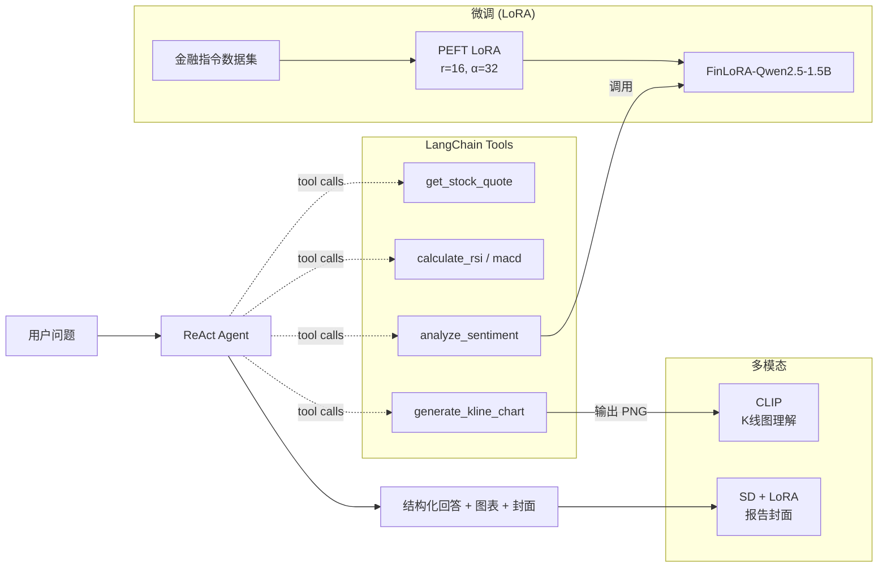

# FinLoRA-Agent

> 把 LLM 微调 / Agent 编排 / 多模态生成串成一个完整的「量化研究助手」。
>
> A complete *fine-tune → agent → multimodal* pipeline for quantitative finance research.

[English](./README_EN.md) · [中文版]

---

## TL;DR

| 模块 | 技术 | 一句话总结 |
| --- | --- | --- |
| **微调 (1.5B)** | Qwen2.5-1.5B-Instruct + LoRA (PEFT/TRL) | 2K 金融情感样本，3 epoch / A6000 / 约 4 min，**acc 53.5% → 62.5%**。 |
| **微调 (32B)** | Qwen2.5-32B-Instruct + **QLoRA** (NF4 4bit + double quant) | 同数据 + 同 LoRA 配置，单卡 A6000 48GB，~1h40min，**acc 63.0% → 82.5%**（scale × tuning 复合增益）。 |
| **Agent** | LangChain ReAct | 6 个 tool: 报价 / RSI / MACD / **缠论 (czsc)** / 情感分析 / K 线绘图。 |
| **本土量化框架** | [czsc](https://github.com/waditu/czsc) (缠中说禅) | 接入国内主流缠论库, A 股代码自动走 akshare → 输出最近 笔/分型/中枢 结构。 |
| **图像理解** | CLIP zero-shot | 给 K 线图打 BULLISH / BEARISH / SIDEWAYS / VOLATILE 标签。 |
| **图像生成** | Stable Diffusion + LoRA | SD 1.5 文生图做报告封面，含一个 SD-LoRA 风格迁移训练脚本。 |
| **Demo** | Gradio | 一站式 Web UI，4 个 Tab 涵盖全部能力。 |

---

## 项目动机

量化研究的工作流里有大量「读新闻判方向 / 看 K 线判形态 / 给策略写报告」的环节，
都可以用生成式 AI 加速。但通用 LLM 在金融语料上有两类常见问题：

1. **情感判断保守**——倾向输出 NEUTRAL，错过有方向性的信号；
2. **不会调用工具**——无法把"看新闻"和"查行情"自动衔接起来。

本项目用 **LoRA 微调** 解决问题 1，用 **LangChain ReAct Agent** 解决问题 2，
并补一个 **多模态** 模块覆盖图像理解/生成的常见量化场景。

为了贴近国内量化研究语境，Agent 工具集里专门接入了 [**czsc 缠中说禅**](https://github.com/waditu/czsc)
框架——A 股代码（如 `600519`、`000001`）会自动走 akshare 拉取行情并按缠论解析出
最近的「笔 / 分型 / 中枢」结构，与西方的 RSI/MACD 形成互补视角；这是国内量化基金
做技术面研究的主流范式之一。

---

## 项目结构

```
FinLoRA-Agent/
├── data/
│   ├── prepare_data.py          # 拉 HF 数据 + 兜底 samples
│   └── samples/                 # 35 条手工中英混合样例
├── train/
│   ├── train_lora.py            # 1.5B LoRA: PEFT + TRL.SFTTrainer
│   ├── train_qlora.py           # 32B QLoRA: bnb 4bit NF4 + grad ckpt + LoRA fp32
│   ├── eval_model.py            # base vs (Q)LoRA acc/F1/confusion-matrix, 支持 --load-in-4bit
│   ├── plot_curves.py           # 训练曲线绘制
│   └── configs/qwen_lora.yaml   # LLaMA-Factory 等价配置 (二选一即可)
├── agent/
│   ├── sentiment_llm.py         # 微调模型推理封装 (单例 + LoRA 合并)
│   ├── tools.py                 # 6 个 LangChain Tool: 报价/RSI/MACD/情感/绘图/czsc缠论
│   ├── czsc_tool.py             # 缠论结构分析 (akshare A股 + 缠中说禅 笔/分型/中枢)
│   └── finance_agent.py         # ReAct Agent (支持 OpenAI / DeepSeek / 本地)
├── multimodal/
│   ├── chart_understanding.py   # CLIP zero-shot K 线图分类
│   ├── sd_generate.py           # SD 文生图 (支持挂载自训 LoRA)
│   └── train_sd_lora.py         # SD UNet cross-attn LoRA 训练脚本
├── demo/app.py                  # Gradio 4-Tab 演示
├── eval/                        # 评测结果 json
└── scripts/                     # 一键脚本
```

---

## 架构图



---

## 快速开始

### 1. 环境

```bash
git clone https://github.com/<your-user>/FinLoRA-Agent.git
cd FinLoRA-Agent
pip install -r requirements.txt
```

### 2. 准备数据

```bash
# 默认拉 HF: FinGPT/fingpt-sentiment-train，自动 fallback 到本地 samples
python data/prepare_data.py
# 或强制走本地样例
python data/prepare_data.py --source samples
```

### 3. 训练

**Path A — 1.5B LoRA (4 min)**：从零写的 PEFT + TRL.SFTTrainer 训练脚本。
```bash
python train/train_lora.py \
    --base-model Qwen/Qwen2.5-1.5B-Instruct \
    --train-data data/processed/train.jsonl \
    --eval-data  data/processed/eval.jsonl \
    --output-dir checkpoints/finlora-qwen2.5-1.5b
```
A6000 / batch 8 / 3 epoch 实测：**~4 min**，显存峰值 **~14 GB**。

**Path B — 32B QLoRA (≈1h40min)**：单卡 A6000 48GB 微调 32B 模型。
```bash
python train/train_qlora.py \
    --base-model Qwen/Qwen2.5-32B-Instruct \
    --output-dir checkpoints/finlora-qwen2.5-32b-qlora
```
关键技术栈：bnb 4bit NF4 + double quant + grad checkpointing (reentrant=False) + LoRA fp32。
A6000 / batch 2 / grad_accum 8 / 3 epoch 实测：**~100 min**，显存峰值 **~24.5 GB**。

**Path C — LLaMA-Factory 等价配置**（生态友好）：
```bash
llamafactory-cli train train/configs/qwen_lora.yaml
```

### 4. 评测对比

```bash
# 1.5B 路径
python train/eval_model.py                                            # base
python train/eval_model.py --adapter checkpoints/finlora-qwen2.5-1.5b # +LoRA

# 32B 路径 (都走 4bit 推理省显存)
python train/eval_model.py --base-model Qwen/Qwen2.5-32B-Instruct --load-in-4bit
python train/eval_model.py --base-model Qwen/Qwen2.5-32B-Instruct --load-in-4bit \
    --adapter checkpoints/finlora-qwen2.5-32b-qlora

# 训练曲线
python train/plot_curves.py
```

### 5. Agent 调用

```python
from agent.finance_agent import run_agent
out = run_agent("TSLA 最近怎么样？看下 RSI 并结合最近一条新闻情感分析。", backend="local")
print(out["output"])
```

### 6. Web Demo

```bash
python demo/app.py --adapter checkpoints/finlora-qwen2.5-1.5b
# 浏览器打开 http://localhost:7860
```

---

## 训练 & 评测结果

所有结果均在 N=200 的 hold-out eval set 上跑出，详细 metric 见 `eval/results_*.json`，
完整对比表见 [`eval/SUMMARY.md`](./eval/SUMMARY.md)。

### Scaling 对比表（1.5B vs 32B，base vs (Q)LoRA）

| 模型 | 可训参数 | Acc | Macro-F1 | POS F1 | NEG F1 | NEU F1 |
| --- | --- | --- | --- | --- | --- | --- |
| Qwen2.5-1.5B (base) | — | 0.535 | 0.512 | 0.640 | 0.507 | 0.388 |
| Qwen2.5-1.5B + **LoRA** | 4.36M (0.28%) | 0.625 | 0.634 | 0.656 | **0.791** | 0.454 |
| Qwen2.5-32B (base, 4bit NF4) | — | 0.630 | 0.636 | 0.660 | 0.821 | 0.427 |
| Qwen2.5-32B + **QLoRA** | ~30M (~0.09%) | **0.825** | **0.829** | **0.823** | **0.857** | **0.807** |

训练曲线：`assets/training_curves.png` (1.5B) · `assets/training_curves_32b.png` (32B)

### 三个非平凡观察

**1. Scale 和 tuning 是两条独立增益维度，乘性叠加而非加性**

- 1.5B+LoRA = 0.625 vs 32B base = 0.630 → 几乎打平。说明**单看 acc，"小模型 + LoRA" ≈ "大模型 zero-shot"**。
- 32B+QLoRA = 0.825 → 比上述两者都多 +20pp。说明 **scale × tuning** 是乘性增益，
  既不是大模型自己就够好，也不是小模型微调就够好。

**2. LoRA 在不同规模 base 上"修不同的洞"**

- 1.5B base 的弱项是 NEG F1 = 0.507 (倾向回避方向性判断) → LoRA 主修 **+28pp NEG F1**。
- 32B base 的弱项反过来：NEG F1 已经 0.821 (scale 把保守 prior 自然克服了)，但 NEU F1 = 0.427
  (太自信，把模糊样本错判成 POS/NEG)。QLoRA 主修 **+38pp NEU F1**。
- 同样的 LoRA 配置 (r=16, α=32, target=q/k/v/o)，作用方向完全相反 ——
  **小模型上是"敢说话"，大模型上是"懂闭嘴"**。这是定量证据：LoRA 不是机械放大，是行为校准。

**3. QLoRA (NF4 4bit) 在 32B 上是可重复的工程路径**

- 单卡 A6000 48GB 训完 32B，~1h40min / 3 epoch，显存峰值 24.5GB (留 24GB 余量做更长 seq)。
- 推理也走 4bit (`eval_model.py --load-in-4bit`)，把 32B 推理成本压到 ~24GB GPU，
  能跑在大多数 24GB-class 工作站显卡上 (4090 / 3090 / A5000)。

### 32B QLoRA 训练过程中遇到 + 解决的真实 bug

训完 32B 之前撞到一个非平凡的 silent failure：
**grad_norm 恒等于 0，loss 不动，但 sanity check 显示梯度计算正常**。
经过 6 个假设排查 + 直接读 saved `adapter_model.safetensors` 验证 `lora_B` 是否仍是初始零矩阵，
最终定位到根因：

> TRL 0.22.2 的 `SFTTrainer.__init__` 在检测到传入的是 `PeftModel` 时，会再调一次 `prepare_peft_model(...)`，
> 该函数对量化模型会再次调 `prepare_model_for_kbit_training(...)` —— 把所有参数 freeze 掉。
> 因为此时它看到 `peft_config=None`（外部已 `get_peft_model` 过了），不会再 wrap，
> 结果 LoRA 参数永远是 frozen → optimizer 看到 0 个 trainable param → 永远 no-op。

修法是把未 wrap 的量化 base model + `peft_config=lora_cfg` 一起交给 SFTTrainer，让 TRL 自己按正确顺序 prepare + wrap：

```python
# 旧 (broken)
model = prepare_model_for_kbit_training(model, ...)
model = get_peft_model(model, lora_cfg)
trainer = SFTTrainer(model=model, ...)        # ← 传 PeftModel, TRL 内部再 freeze 一遍

# 新 (fixed)
trainer = SFTTrainer(model=model, ...,
                     peft_config=lora_cfg)    # ← 让 TRL 自己 prepare + get_peft_model
```

诊断手段是直接读 saved adapter 的 `lora_B` L2 范数 (初始为全 0)：

```python
import safetensors.torch as st
w = st.load_file('checkpoints/.../adapter_model.safetensors')
total = sum(w[k].float().norm()**2 for k in w if 'lora_B' in k) ** 0.5
# 0.000000e+00 → 优化器 step 一次都没真的更新
```

这个 bug 在 `transformers==4.57 + peft==0.19 + trl==0.22 + bnb==0.49` 组合下稳定复现。
代码里保留了 `[probe] optimizer params: X, model trainable: Y, intersection: Z`
一行诊断，下次任何环境再撞类似 bug 可以 30 秒定位。

---

## 仓库不包含什么 (避免误解)

- 不含训练好的 LoRA 权重 (~50 MB)，请按上面命令自训；
- 不含原始大数据集，会在 `data/processed/` 自动生成；
- `outputs/` 与 `checkpoints/` 已加入 `.gitignore`。

---

## License

MIT
