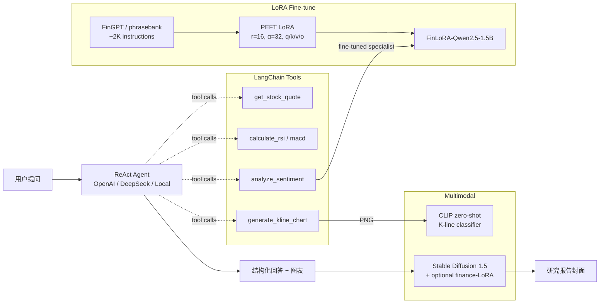

# Architecture (mermaid 源码)

```mermaid
flowchart LR
    subgraph FT["LoRA Fine-tune"]
        D[FinGPT / phrasebank<br/>~2K instructions] --> P[PEFT LoRA<br/>r=16, α=32, q/k/v/o]
        P --> M[FinLoRA-Qwen2.5-1.5B]
    end

    subgraph Tools["LangChain Tools"]
        T1[get_stock_quote]
        T2[calculate_rsi / macd]
        T3[analyze_sentiment]
        T4[generate_kline_chart]
    end

    subgraph MM["Multimodal"]
        C[CLIP zero-shot<br/>K-line classifier]
        S[Stable Diffusion 1.5<br/>+ optional finance-LoRA]
    end

    U[用户提问] --> AG[ReAct Agent<br/>OpenAI / DeepSeek / Local]
    AG -. tool calls .-> T1 & T2 & T3 & T4
    T3 -- fine-tuned specialist --> M
    T4 -- PNG --> C
    AG --> ANS[结构化回答 + 图表]
    ANS --> S
    S --> COVER[研究报告封面]
```
