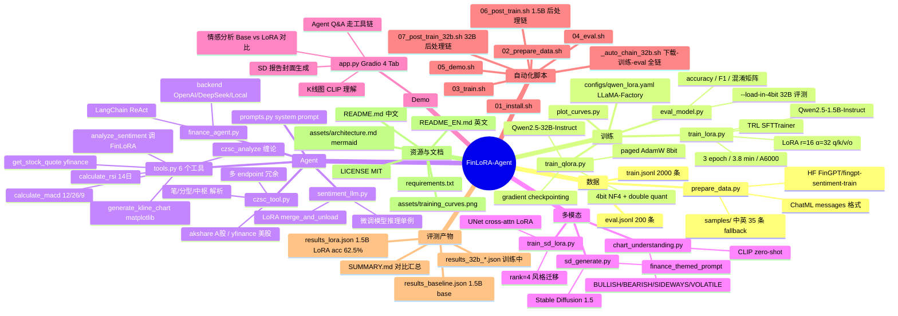

# FinLoRA-Agent · 模块思维导图

> GitHub 原生渲染 mermaid 思维导图，点开就能看完整层级。

## 模块速查表

| 模块 | 解决的问题 | 关键技术 |
| --- | --- | --- |
| **数据** | 把 FinGPT 数据转成可微调的 ChatML | datasets, samples fallback |
| **训练 (1.5B LoRA)** | 让 base 模型敢做方向性判断 | PEFT + TRL.SFTTrainer |
| **训练 (32B QLoRA)** | 单卡 A6000 上微调 32B 大模型 | NF4 + double quant + paged AdamW + grad ckpt |
| **Agent** | 把工具链 + 微调模型串成可问答智能体 | LangChain ReAct |
| **czsc 工具** | 用国内主流的缠论范式做技术分析 | czsc + akshare |
| **多模态-图像理解** | K 线图分类、视觉信号融合 | CLIP zero-shot |
| **多模态-图像生成** | 给研究报告自动生成配图 | Stable Diffusion + LoRA |
| **Demo** | 把全套能力可视化、能现场跑 | Gradio 4-Tab |
| **自动化** | 本地断网/关机也能跑完整 pipeline | nohup chain + post-train hooks |
| **评测** | 量化证明微调有效、scale up 有效 | accuracy/F1/confusion matrix |

也可参考 [`architecture.md`](./architecture.md) 看数据流向架构图。
